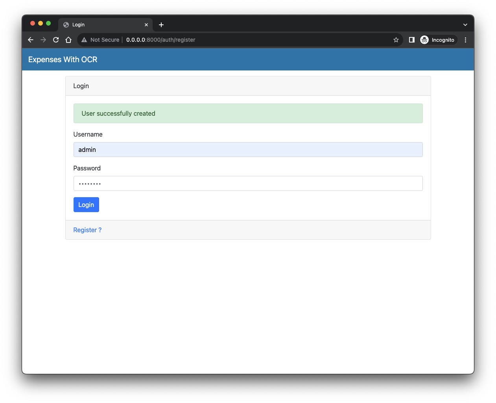
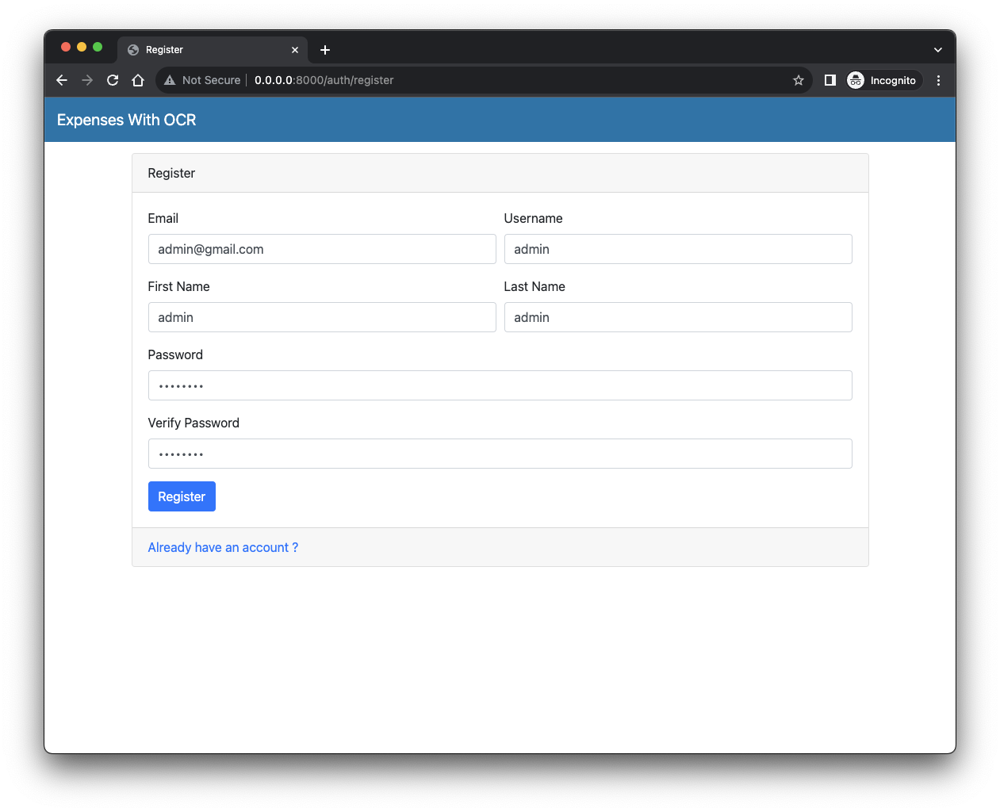
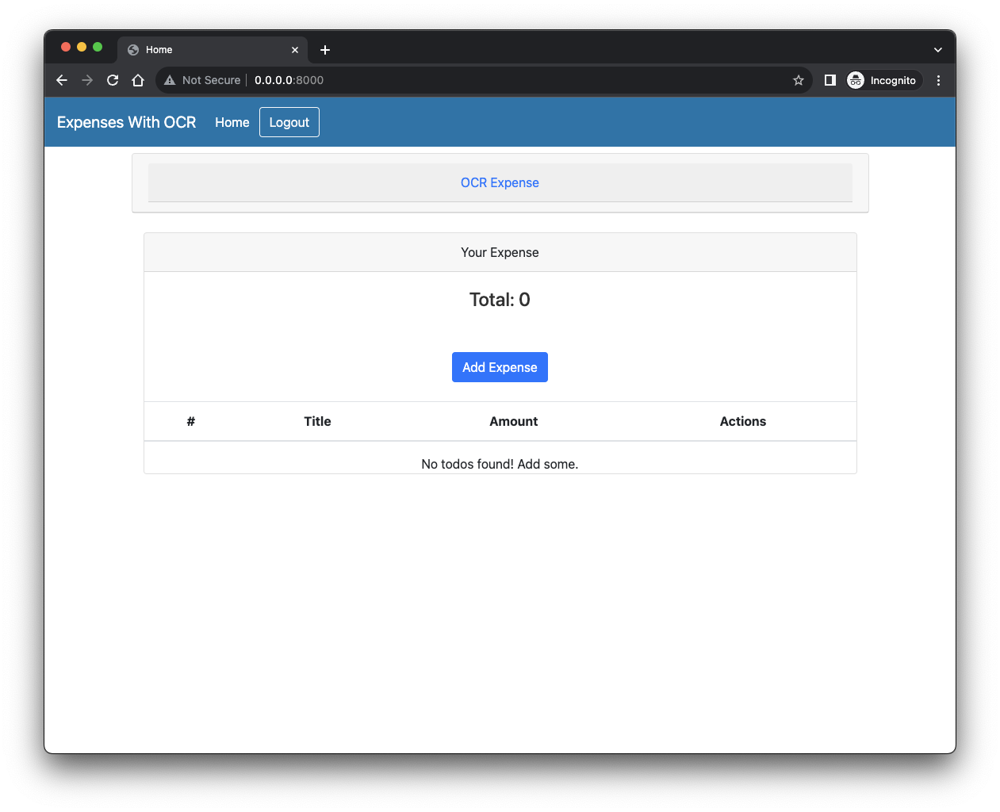
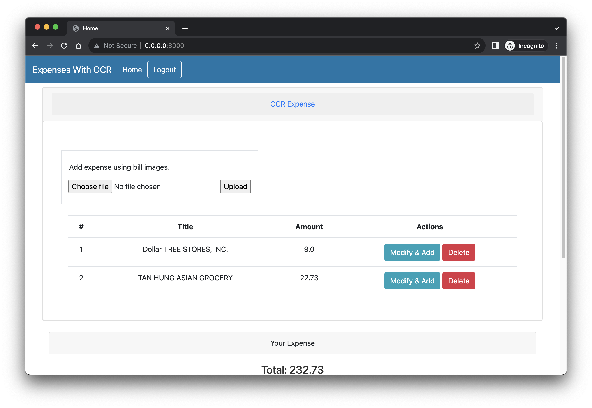
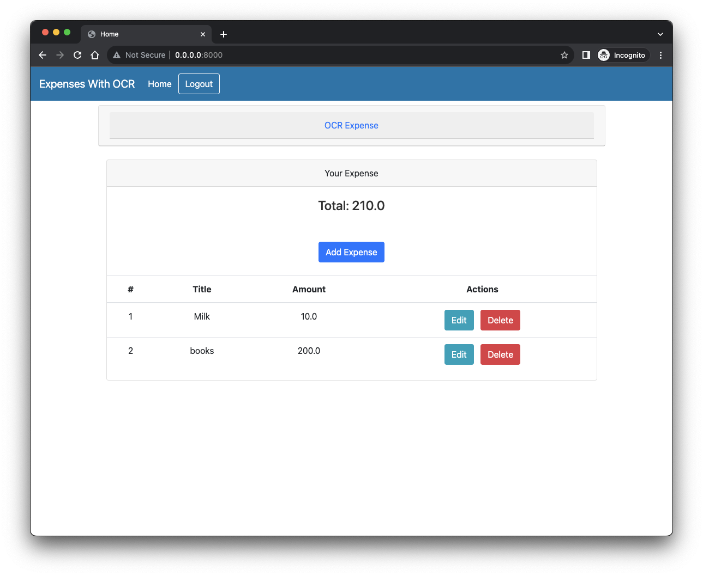
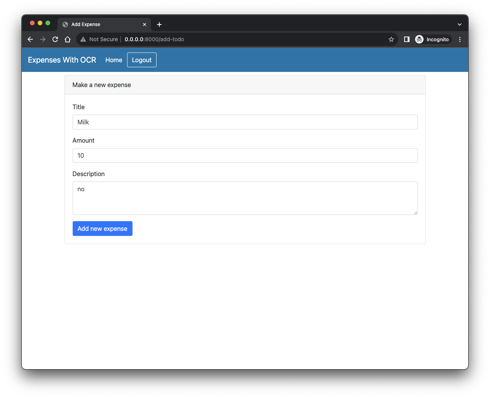
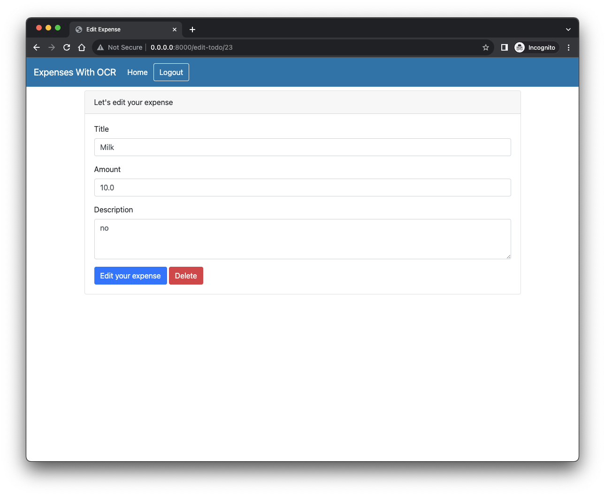
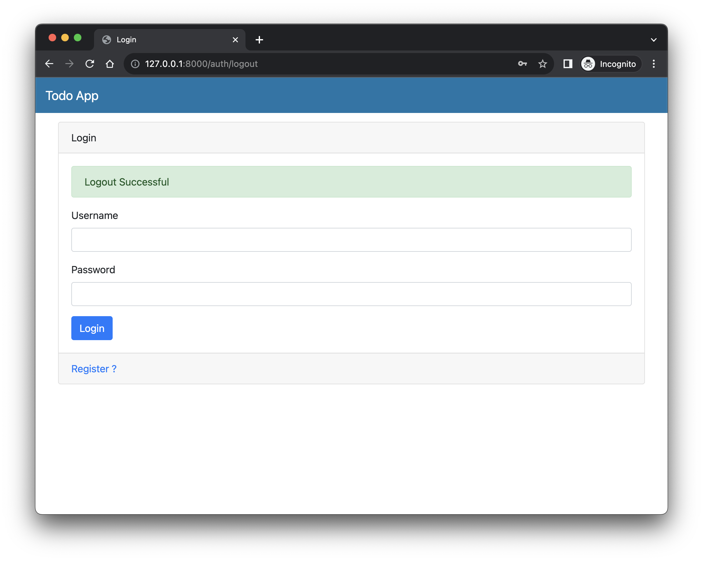

# Expense With OCR

## 🚀 Demo

**Login**
<p align = "center"></p>

**Register**
<p align = "center"></p>

**Home**
<p align = "center"></p>

**OCR Expense List**
<p align = "center"></p>

**Expense List**
<p align = "center"></p>

**Add Expense**
<p align = "center"></p>

**Edit Expense**
<p align = "center"></p>

**Logout**
<p align = "center"></p>


## ⚒️ Set-Up Instructions

<p align = "center"></p>

- Open your terminal / command prompt. 

- Clone the repository 
    ```
    git clone repo
    ```
- Change the directory to the cloned project
    
    ```
    cd OCRExpenses
    ```

- Ensure you have any version of [Python](https://www.python.org/downloads/) below 3.10 installed in your system and you have ``virtualenv`` package installed

    ```
    which python
    ```

    ```
    pip install virtualenv
    ```

- Create a new virtual environment
    ```
    python -m venv env
    ```

- Activate virtual enviroment
    - On Mac/Linux
        ```terminal
        source env/bin/activate
        ```
    - On Windows
        ```terminal
        env/Scripts/Activate.ps1 
        ```
- Install the dependencies
    ```
    pip install -r requirements.txt
    ```
> **IMPORTANT**:
  > - Prepare **.env** file
  > - Create a bucket in your s3, For first-time run uncomment [this line](https://github.com/gopalkatariya44/OCRExpenses/blob/main/ocr.py#L65)
  > - Allow IAM user to have full access to S3 and Textract
  
- Run the Web application
    ```
    python main.py
    ```
    > **Note**:
    > - navigate to  `http://localhost:8000`
